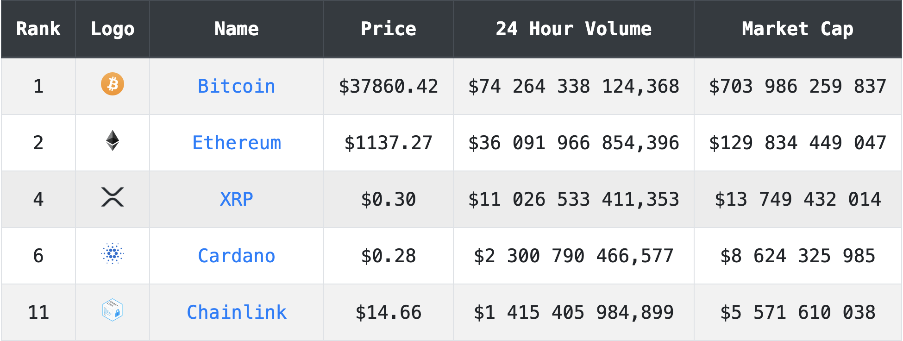

# Crypto Cashier

Tracks any cryptocurrency's rank, current price, market cap and 24hr volume you want. Quote information gathered from [CoinPaprika](https://coinpaprika.com/home-overview?sort%5Bsort%5D=index&sort%5Bsortorder%5D=asc). This cryptocurrency dashboard uses javascript and [React](https://reactjs.org/).

## Running dashboard:
While in the Crypto-Tracker directory run 'npm install' to install all the necessary packages and their dependencies. Then run 'npm run start'.

## Notes:
- Must enter your own key for the CoinPaprika api found [here](https://english.api.rakuten.net/lbraciszewski/api/coinpaprika1).
-

## To Do:
-  Add 24 hour change in price.
- 

